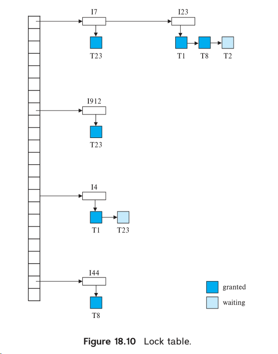

## 项目说明

数据库中上的事务而可以并发执行，为了确保事务操作的正确交错，DBMS将使用一个锁管理器(LM)来控制何时允许事务访问数据项。LM的基本思想是：它维护有关当前活动事务持有的锁的内部数据结构。事务在被允许访问数据项之前，会向LM发出锁请求。LM将向调用事务授予锁、阻塞该事务或中止该事务。

LM在对RID加锁的过程中可能会导致死锁的出现，死锁可以通过死锁避免或者死锁处理来解决。在task1中不需要考虑可能出现死锁的情况，即实现的LM不需要具备处理死锁的功能。只需要实现如下功能：

* 当一个事务调用加锁请求时：LM根据对应记录的请求队列内的事务请求状态，来对当前请求事务执行赋予、阻塞或者中止操作。
* 当一个事务调用解锁请求时：LM从记录的请求队列中删除对应请求，并且判断是否可以赋予锁给被阻塞的事务。

## 思路

### 请求队列的实现



课程参考书中给出了lock manager中请求队列的概念图，并且包含了相关了实现思路，总结如下：

* 每个RID对应一个请求队列，多个事务可以并发地向RID提出加锁请求。
* 当一个事务向某一条记录RID发出加锁请求时，即向对应的请求队列添加一条请求，当事务对RID解锁时，将对应的请求从请求队列中删除。
* 加入请求队列的请求可能有两种状态：granted或waiting，用`LockRequest`中的`granted_`变量来表示，grant表示当前事务获得锁，可以继续执行，waiting表示请求事务被阻塞，需要用条件变量来实现。
* 请求队列应该保证并发量以及请求的先后顺序，多个读请求可以同时执行，读请求和写请求不能同时进行。

第一个关键点是向请求队列中插入请求时，如何判断请求的状态（即granted的值是否为true)，对应事务是否被阻塞：

* 如果队列为空，则事务可以继续执行。
* 如果队列不为空，需要判断队尾请求的状态：
  * 如果队尾请求为`Shared`且`granted == true`，则事务可以继续执行。
  * 否则事务需要被阻塞直到可以执行。

第二个关键点是从队列中删除请求时，如何修改其他请求的状态：

* 如果队列为空，则返回
* 否则判断队首的请求是否granted
  * 如果granted，则判断请求的LockMode
    * 如果LockMode为Exclusive，求grant当前请求
    * 如果LockMode为Shared，则从队列头部向后遍历，grant所有LockMode为Shared的请求
  * 如果not granted，则返回

## 实现

### 对bustub提供的api的修改

个人觉得bustub提供的api不是很直观，所以笔者按照自己的思路修改了其中的一些api，主要包含如下改动：

* 一个`LockRequest`持有一个`condition_variable`，而不是`LockRequestQueue`。
* 向`LockRequest`和`LockRequestQueue`中添加了若干成员函数。

```cpp
enum class LockMode { SHARED, EXCLUSIVE, UPGRADING };

class LockRequest {
 public:
  LockRequest(txn_id_t txn_id, LockMode lock_mode, bool granted)
      : txn_id_(txn_id), lock_mode_(lock_mode), granted_(granted) {}

  txn_id_t txn_id_;
  LockMode lock_mode_;
  bool granted_;
  // for notifying blocked transactions on this rid
  std::condition_variable cv_;
  std::mutex mutex_;

  void Wait() {
    std::unique_lock<std::mutex> lk(mutex_);
    cv_.wait(lk);
  }

  void Grant() {
    std::unique_lock<std::mutex> lk(mutex_);
    granted_ = true;
    cv_.notify_one();
  }
};

class LockRequestQueue {
 public:
  std::list<LockRequest> request_queue_;
  // txn_id of an upgrading transaction (if any)
  txn_id_t upgrading_{INVALID_TXN_ID};

  bool CanGrant(LockMode mode);
  void Insert(Transaction *txn, const RID &rid, LockMode mode, std::unique_lock<std::mutex> &lck);
  void Remove(Transaction *txn, const RID &rid, bool upgrading);
  void UpdateGrant();
};
```

### 向请求队列中插入请求

```cpp
bool LockManager::LockRequestQueue::CanGrant(LockMode mode) {
  if (request_queue_.empty()) {
    return true;
  }
  auto &last = request_queue_.back();
  if (mode == LockMode::SHARED) {
    return last.granted_ && last.lock_mode_ == LockMode::SHARED;
  }
  return false;
}

void LockManager::LockRequestQueue::Insert(Transaction *txn, const RID &rid, LockMode mode, std::unique_lock<std::mutex> &lck) {
  txn_id_t txn_id = txn->GetTransactionId();
  bool can_grant = CanGrant(mode);
  auto &last = request_queue_.emplace_back(txn_id, mode, can_grant);
  if (!can_grant) {
    lck.unlock();
    last.Wait();
  }
  if (mode == LockMode::SHARED) {
    txn->GetSharedLockSet()->insert(rid);
  } else {
    txn->GetExclusiveLockSet()->insert(rid);
  }
}
```

### 从请求队列中删除某个请求

```cpp
void LockManager::LockRequestQueue::Remove(Transaction *txn, const RID &rid, bool upgrading) {
  txn_id_t txn_id = txn->GetTransactionId();
  auto iter = std::find_if(request_queue_.begin(), request_queue_.end(),
                           [txn_id](const LockRequest &request) { return request.txn_id_ == txn_id; });
  assert(txn->GetState() == TransactionState::ABORTED || (iter != request_queue_.end() && iter->granted_));
  if (upgrading) {
    assert(iter->lock_mode_ == LockMode::SHARED);
  }
  if (iter->lock_mode_ == LockMode::SHARED) {
    txn->GetSharedLockSet()->erase(rid);
  } else {
    txn->GetExclusiveLockSet()->erase(rid);
  }
  if (txn->GetState() != TransactionState::ABORTED) {
    request_queue_.erase(iter);
  }
}

void LockManager::LockRequestQueue::UpdateGrant() {
  if (request_queue_.empty()) {
    return;
  }
  auto &first = request_queue_.front();
  if (!first.granted_) {
    if (first.lock_mode_ == LockMode::EXCLUSIVE) {
      first.Grant();
    } else {
      for (auto iter = request_queue_.begin();
           iter != request_queue_.end() && iter->lock_mode_ == LockMode::SHARED; iter++) {
        iter->Grant();
      }
    }
  }
}
```

### Lock

* LockExclusive

```cpp
bool LockManager::LockExclusive(Transaction *txn, const RID &rid) {
  std::unique_lock<std::mutex> lk(latch_);
  if (txn->GetState() != TransactionState::GROWING) {
    txn->SetState(TransactionState::ABORTED);
    return false;
  }
  if (txn->IsExclusiveLocked(rid)) {
    return false;
  }
  auto &q = lock_table_[rid];
  q.Insert(txn, rid, LockMode::EXCLUSIVE, lk);
  return true;
}
```

* LockShared

```cpp
bool LockManager::LockShared(Transaction *txn, const RID &rid) {
  std::unique_lock<std::mutex> lk(latch_);
  if (txn->GetState() != TransactionState::GROWING) {
    txn->SetState(TransactionState::ABORTED);
    return false;
  }
  if (txn->IsSharedLocked(rid)) {
    return false;
  }
  auto &q = lock_table_[rid];
  q.Insert(txn, rid, LockMode::SHARED, lk);
  return true;
}
```

* LockUpgrade

```cpp
bool LockManager::LockUpgrade(Transaction *txn, const RID &rid) {
  std::unique_lock<std::mutex> lk(latch_);
  if (txn->GetState() != TransactionState::GROWING) {
    txn->SetState(TransactionState::ABORTED);
    return false;
  }
  if (txn->IsExclusiveLocked(rid)) {
    return false;
  }
  auto &q = lock_table_[rid];
  if (q.upgrading_ != INVALID_TXN_ID) {
    txn->SetState(TransactionState::ABORTED);
    return false;
  }
  q.upgrading_ = txn->GetTransactionId();
  q.Remove(txn, rid, true);
  q.Insert(txn, rid, LockMode::EXCLUSIVE, lk);
  q.upgrading_ = INVALID_TXN_ID;
  return true;
}
```

### Unlock

```cpp
bool LockManager::Unlock(Transaction *txn, const RID &rid) {
  std::unique_lock<std::mutex> lk(latch_);
  if (txn->GetState() == TransactionState::GROWING) {
    txn->SetState(TransactionState::SHRINKING);
  }
  auto &q = lock_table_[rid];
  q.Remove(txn, rid, false);
  q.UpdateGrant();
  return true;
}
```
